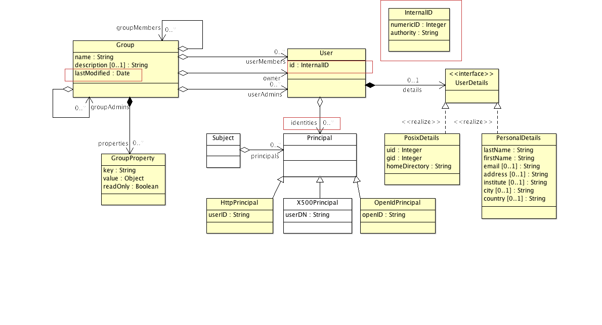

# cadcAccessControl

## Description
The cadcAccessControl module contains the shared model classes and exceptions used by the access control clients and server.  It also contains the UserClient and GMSClient (group management service client).

## Object Model
The CADC User Authorization Model is a model for representing users and groups.

In the system, a user is uniquely identified by one Principal (e.g. NumericPrincipal) but can have a number of other  identities for different contexts:

- HttpPrincipal: Web user identity associated with Simple HHTP User Password access.
- X500Principal: X509 certificate identity.
- NumericPrincipal: An numeric identity associated with a user. Typically, used internally within a system.
- OpenIdPrincipal: An OpenID identity.

Groups represet associations of users. Groups have an owner, administive members, and actual members.  Members can be groups or users.

## Build and Test Dependencies

### opencadc dependencies:
- opencadc/core/cadcUtil
- opencadc/reg/cadcRegistry

### external build dependencies
- json.jar (json.org-20110818.jar)
- jdom2.jar (jdom-2.0.5.jar)
- log4j.jar (log4j-1.2.17.jar)

### external test dependencies
- xerces.jar (xerces-2_9_1)
- asm.jar (hibernate-3.2.3)
- cglib.jar (hibernate-3.2.3)
- easymock.jar (easymock-3.0.jar)
- junit.jar (junit-4.6.jar)
- objenesis.jar (objenesis-1.2.jar)
- jsonassert.jar (jsonassert-1.2.3.jar)
